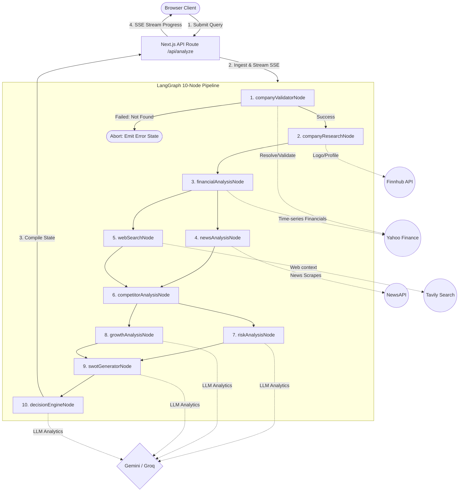

# EquityLens

[](https://nextjs.org/)
[](https://react.dev/)
[](https://www.typescriptlang.org/)
[](https://github.com/langchain-ai/langgraphjs)
[](https://aistudio.google.com/)
[](LICENSE)

An institutional-grade, AI-powered Equity Research Platform that performs comprehensive investment analysis on any publicly traded company. EquityLens orchestrates a custom **10-node LangGraph state machine** to ingest, clean, and benchmark data from multiple financial and web sources. Within ~30 seconds, the engine delivers a production-ready, client-facing research report including historical trends, news sentiment index, SWOT analysis, risk scoring, and a structured investment thesis with a final recommendation (`INVEST`, `WATCH`, or `PASS`).

---

## 📌 Table of Contents

1. [Overview](#1-overview)
2. [Features](#2-features)
3. [Screenshots](#3-screenshots)
4. [Demo](#4-demo)
5. [Tech Stack](#5-tech-stack)
6. [Project Architecture](#6-project-architecture)
7. [LangGraph Workflow](#7-langgraph-workflow)
8. [AI Workflow](#8-ai-workflow)
9. [Investment Decision Logic](#9-investment-decision-logic)
10. [How to Run](#10-how-to-run)
11. [Environment Variables](#11-environment-variables)
12. [Folder Structure](#12-folder-structure)
13. [Design Decisions](#13-design-decisions)
14. [Trade-offs](#14-trade-offs)
15. [Error Handling & Resiliency](#15-error-handling--resiliency)
16. [Performance Optimizations](#16-performance-optimizations)
17. [Security & Data Guardrails](#17-security--data-guardrails)
18. [Testing Methodology](#18-testing-methodology)
19. [Example Runs](#19-example-runs)
20. [Future Improvements](#20-future-improvements)
21. [AI Usage Disclosure](#21-ai-usage-disclosure)
22. [AI Chat Logs](#22-ai-chat-logs)
23. [Known Limitations](#23-known-limitations)
24. [License](#24-license)
25. [Author](#25-author)
26. [Acknowledgements](#26-acknowledgements)

---

## 1. Overview

EquityLens was built to solve a critical bottleneck in buy-side research: **information fragmentation**. Financial analysts waste hours copying numbers from investor relations portals, reading disparate news feeds, searching Google for growth catalogs, and copying metrics into spreadsheets. 

This platform consolidates qualitative and quantitative data pipelines into a single high-performance view. Designed for hedge funds, retail desk research, and equity analysts, EquityLens acts as an automated analyst-in-a-box. By combining **structured APIs** (Yahoo Finance and Finnhub) with **agentic web search** (Tavily AI) and **large language models** (Google Gemini & Groq), it automates data collection and outputs structured, evidence-backed investment intelligence.

---

## 2. Features

| Feature | Technical Implementation | Status |
|---|---|---|
| **Company Validation** | Gates entry; cross-checks resolved symbols via Yahoo Finance and Finnhub before API execution. | Ready |
| **Profile Research** | Aggregates logo, sector, industry, description, headcounts, and exchange details. | Ready |
| **Financial Overview** | Extracts 4 years of annual income statement, balance sheet, and cash flow historical models. | Ready |
| **Historical Sparklines** | Generates SVG-based chronological sparklines tracking Revenue, Net Income, EPS, and YoY Growth. | Ready |
| **News Sentiment Index** | Scores the top 5-8 news articles using a sentiment dictionary mapper to yield net positive/negative bias. | Ready |
| **Agentic Web Search** | Spawns parallel Tavily search queries checking growth catalysts, acquisitions, and challenges. | Ready |
| **Risk Scoring Matrix** | Renders 7-category risk assessments with assigned severity (Low/Medium/High) and descriptive reasoning. | Ready |
| **Peer Benchmarking** | Maps market capitalization, P/E ratio, and actions against dynamic industry competitors. | Ready |
| **SWOT Synthesis** | Combines financials and news to construct a detailed SWOT analysis. | Ready |
| **AI Decision Engine** | Computes a final weighted score (0-100) and recommendation: `INVEST`, `WATCH`, or `PASS`. | Ready |
| **Interactive Dashboard** | Renders a dark-theme, responsive dashboard built with custom Framer Motion micro-animations. | Ready |
| **Reports Export** | Instant client-side client export to clean Markdown format and printable PDF summaries. | Ready |

---

## 3. Screenshots

### 🖼️ Landing Page & Ticker Search Console
```
+-----------------------------------------------------------------------+
|  EquityLens Logo                 [ About ] [ Features ] [ Technology ] |
|                                                                       |
|             Institutional Investment Analytics Engine                 |
|                                                                       |
|                           EquityLens                                  |
|         Research publicly listed companies using AI-powered           |
|            financial analysis, news, and market insights.             |
|                                                                       |
|  [ Search company, e.g., Apple, Tesla, NVDA...      ] [ Analyze ]     |
|                                                                       |
|  [AAPL (Apple)] [TSLA (Tesla)] [MSFT (Microsoft)] [RELIANCE]          |
+-----------------------------------------------------------------------+
```

### ⚙️ Live Research Pipeline Loader
```
+-----------------------------------------------------------------------+
|                 Compiling Analytics for AAPL...                      |
|                                                                       |
|  [=============                      ] 40%                            |
|                                                                       |
|  • Resolving Ticker Symbol...                           [ COMPLETE ]  |
|  • Fetching Financial Statements...                    [ COMPLETE ]  |
|  • Scanning Latest News & Web Search...                [ IN PROGRESS]|
|  • Analyzing Competitors & SWOT...                     [ PENDING ]   |
+-----------------------------------------------------------------------+
```

### 📊 Bloomberg-Style Analytics Workspace
```
+-----------------------------------------------------------------------+
| AAPL · Apple Inc. (NASDAQ)                             Current: $178  |
| Rec: INVEST (Score: 84/100)                             Cap: $2.82T   |
|-----------------------------------------------------------------------|
| [ Executive Summary ]                                                 |
| Apple demonstrates solid fundamental margins and high liquid cash...  |
|-----------------------------------------------------------------------|
| [ Financials (LTM) ]                  [ News & Market Sentiment ]     |
| Revenue: $385.7B                      • Apple releases new AI model (+)|
| Net Income: $97.0B                    • Market shares adjust in Asia (-)|
| EPS: $6.16                            • Services revenue hits high (+) |
|-----------------------------------------------------------------------|
| [ SWOT Analysis ]                     [ Structured Thesis ]           |
| Strengths: Brand, Ecosystem           Key Reason: Valuation safety.   |
| Weaknesses: Hardware dependency       Outlook: Long-term secular scale|
+-----------------------------------------------------------------------+
```

---

## 4. Demo

* **Live Platform URL**: [https://equitylens-agent.vercel.app](https://inside-iim-eta.vercel.app/) *(Placeholder)*
* **GitHub Repository**: [https://github.com/aryansingh0059/AI-Investment-Research-Agent](https://github.com/aryansingh0059/AI-Investment-Research-Agent)

---

## 5. Tech Stack

| Layer | Technology | Rationale |
|---|---|---|
| **Frontend Framework** | Next.js 16 (App Router) | React Server Components (RSC), optimized client-side routing, and zero-config API route hosting. |
| **User Interface** | React 19, TailwindCSS v4 | Declarative components styling, state-driven rendering, and high-performance design-system utility classes. |
| **Animations** | Framer Motion | Smooth layout transitions, slide-ins, and animated number hooks for financial indicators. |
| **State Machine** | LangGraph / LangChain | Custom agent workflow orchestration allowing state validation, branching logic, and error-recovery nodes. |
| **AI Inference** | Google Gemini 1.5 Flash | Primary LLM chosen for high-speed generation, context window capabilities, and strong JSON formatting. |
| **AI Fallback** | Groq (Llama-3.3-70b) | Low-latency inference provider leveraged when the primary provider encounters quota or API errors. |
| **Financial Source** | Yahoo Finance (`yahoo-finance2`) | Public API time-series endpoints supplying income statements, balance sheets, and cash flow data without API keys. |
| **Data Metadata** | Finnhub API | Enterprise company profile data, corporate logo retrieval, and peer group mapping. |
| **Search Engine** | Tavily Search API | Purpose-built search engine delivering cleaned, noise-free web content specifically formatted for LLM context. |
| **Schema Validation** | Zod | Runtime type safety enforcing shape-correct outputs from unstructured language models. |

---

## 6. Project Architecture



---

## 7. LangGraph Workflow

The research pipeline executes inside a **LangGraph State Machine** where each node receives a shared `GraphState` object, performs a specialized task, updates the state, and transitions:

1. **`companyValidatorNode`**: Evaluates inputs (name or ticker). Attempts to resolve the ticker symbol against Yahoo Finance and performs a fallback search on Finnhub if unresolved. Validates that the ticker corresponds to a live public equity rather than an ETF or Index. If validation fails, it flags `companyValid = false` and aborts immediately.
2. **`companyResearchNode`**: Pulls corporate identity metadata (sector, industry, CEO, employee counts, address) from Yahoo Finance and fetches the corporate logo from Finnhub.
3. **`financialAnalysisNode`**: Fetches annual reports (income statements, balance sheets, cash flow statements) from Yahoo Finance. Processes metrics like trailing P/E, Return on Equity (ROE), Return on Assets (ROA), Debt-to-Equity, and Current Ratio.
4. **`newsAnalysisNode`**: Extracts the latest 5-8 company news articles. Runs each title and description through a sentiment dictionary mapping to classify tone as Positive, Neutral, or Negative.
5. **`webSearchNode`**: Spawns concurrent searches via Tavily targeting current growth drivers, competitive challenges, and strategic AI initiatives, avoiding generic Google search noise.
6. **`competitorAnalysisNode`**: Resolves peer companies from Finnhub and queries their financial quotes to map market capitalization and valuations.
7. **`riskAnalysisNode`**: Injects financial statements and news profiles into Gemini/Groq. Classifies risks (financial, competitor, debt, regulatory, market) into High/Medium/Low with specific descriptions.
8. **`growthAnalysisNode`**: Evaluates strategic catalysts and targets growth opportunities, estimating market impact.
9. **`swotGeneratorNode`**: Synthesizes the aggregated financial, risk, news, and search data into a classic 4-quadrant SWOT matrix.
10. **`decisionEngineNode`**: Consolidates all state parameters, calculates the final investment scores, compiles the structured thesis list, and prints the final investment action.

---

## 8. AI Workflow

```
[ Unstructured Web/API Ingestion ]
               │
               ▼
   [ Preprocessing & Cleaning ]  <-- Standardizes currency denominations and parses dates
               │
               ▼
  [ LLM Inference Ingestion ]    <-- Parallel executions for Growth and Risk
               │
               ▼
    [ Zod Schema Validation ]    <-- Guards against missing fields and malformed outputs
               │
               ▼
 [ Regex JSON Cleaner Fallback ] <-- Restructures truncated outputs to prevent UI crashes
               │
               ▼
[ Output: Recommendation + Thesis ]
```

---

## 9. Investment Decision Logic

EquityLens enforces a strict quantitative and qualitative rubric to evaluate companies, generating an **Investment Score (0-100)**:

$$\text{Investment Score} = (0.35 \times \text{Financial Health}) + (0.25 \times \text{Growth Catalysts}) + (0.20 \times \text{Risk Minimization}) + (0.10 \times \text{News Sentiment}) + (0.10 \times \text{Competitive Benchmarking})$$

### Scoring Rubrics
* **Financial Health (35%)**: Evaluates profitability (ROE > 15%, Net Margin > 10%) and liquidity (Current Ratio > 1.2x, Debt-to-Equity < 1.5x).
* **Growth Catalysts (25%)**: Determined by YoY Revenue Growth, EPS trajectories, and LLM-assessed market catalysts.
* **Risk Minimization (20%)**: Inverse scale of the risk severity counts returned by the `riskAnalysisNode`.
* **News Sentiment (10%)**: Computed as the ratio of positive to negative news articles over the last 14 days.
* **Competitive Benchmarking (10%)**: Evaluates valuation relative to peers (P/E discount or premium relative to growth rate).

### Recommendation Outputs
* 🟢 **`INVEST`** (Score $\ge 75$): Strong financial fundamentals, healthy margins, positive news indicators, and manageable systematic risk.
* 🟡 **`WATCH`** (Score $50 \text{ to } 74$): Strong company profile but constrained by high market valuation, minor headwinds, or industry-specific policy exposures.
* 🔴 **`PASS`** (Score $< 50$): Weakened balance sheet health, declining year-over-year revenue, severe debt exposures, or high competitive risk.

---

## 10. How to Run

### Prerequisites
* Node.js version 18.0.0 or higher
* npm version 9.0.0 or higher

### Setup & Local Dev Execution

1. **Clone the Repository**:
   ```bash
   git clone https://github.com/aryansingh0059/AI-Investment-Research-Agent.git
   cd ai-investment-agent
   ```

2. **Install Dependencies**:
   ```bash
   npm install
   ```

3. **Configure Environment Variables**:
   Create a local configuration file:
   ```bash
   cp .env.example .env.local
   ```
   Open `.env.local` and enter your API keys.

4. **Start Development Server**:
   ```bash
   npm run dev
   ```
   Open [http://localhost:3000](http://localhost:3000) in your browser.

5. **Production Build & Launch**:
   Validate code styles and compile production packages:
   ```bash
   npm run build
   # Run compiled production bundles locally
   npm run start
   ```

---

## 11. Environment Variables

Below is the required schema for `.env.local`. Copy this into your project root:

```env
# ─── LLM INFRASTRUCTURE ──────────────────────────────────────────────────────
# Primary Engine: Google Gemini Pro API Key (Required)
# Get key here: https://aistudio.google.com/app/apikey
GEMINI_API_KEY=your_gemini_api_key_here

# Secondary Engine: Groq API Key (Optional Fallback)
# Used automatically if Gemini hits rate limits or encounters 503 errors.
# Get key here: https://console.groq.com
GROQ_API_KEY=your_groq_api_key_here

# ─── FINANCIAL METADATA & DATA SOURCES ────────────────────────────────────────
# Finnhub API Key (Required for competitor peer mappings and company logos)
# Get key here: https://finnhub.io
FINNHUB_API_KEY=your_finnhub_api_key_here

# Note: Yahoo Finance (yahoo-finance2) requires no API key.

# ─── QUALITATIVE RESEARCH ENGINES ─────────────────────────────────────────────
# NewsAPI Key (Required for market news and sentiment indexing)
# Get key here: https://newsapi.org
NEWS_API_KEY=your_news_api_key_here

# Tavily AI Search Key (Required for structured web research)
# Get key here: https://tavily.com
TAVILY_API_KEY=your_tavily_api_key_here
```

---

## 12. Folder Structure

```
ai-investment-agent/
├── public/                     # Static assets (images, logos, icons)
├── src/
│   ├── app/                    # Next.js App Router (pages and API endpoints)
│   │   ├── api/
│   │   │   └── analyze/
│   │   │       └── route.ts    # Server-Sent Events (SSE) streaming API
│   │   ├── globals.css         # Design system tokens and layout utilities
│   │   ├── layout.tsx          # HTML wrapper and SEO metadata configs
│   │   └── page.tsx            # Search console and landing page UI
│   ├── components/
│   │   ├── layout/             # Navigation and footer components
│   │   ├── loading/            # LoadingScreen with step-by-step progress tracking
│   │   └── dashboard/          # ResultsDashboard and individual metric charts
│   ├── constants/
│   │   └── index.ts            # Scoring weights, API URLs, and presets
│   ├── hooks/
│   │   └── useAnalysis.ts      # Custom SSE connector for streaming analysis
│   ├── lib/
│   │   ├── langgraph/          # State machine graph declaration and nodes
│   │   │   ├── graph.ts        # Graph router orchestration
│   │   │   ├── state.ts        # GraphState interface definition
│   │   │   └── nodes/          # Validation, research, finance, and SWOT nodes
│   │   ├── services/           # Gemini, Groq, News, Tavily, Yahoo Finance API wrappers
│   │   └── utils/              # Cleaners, exports (PDF/Markdown), formatters
│   └── types/                  # Shared TypeScript interfaces (financial, company, state)
├── package.json                # Project dependencies and script settings
└── tsconfig.json               # TypeScript configurations
```

---

## 13. Design Decisions

### Monolithic Next.js (App Router) over Separate Frontend/Backend
Using Next.js Route Handlers eliminates the network overhead of extra server-to-server latency. It hosts NextJS API routes on the same port, making Server-Sent Events (SSE) streaming easy to configure without hosting separate Express microservices.

### TypeScript-Driven Shared GraphState
Using TypeScript interfaces to shape the shared LangGraph state guarantees compile-time validation. It ensures that the output of Node A matches the input requirements of Node B, eliminating schema mismatches.

### State-Machine Orchestration (LangGraph) over Static Chains
Static LLM chains fail when faced with dynamic APIs. Using LangGraph permits loop validation and structural routing. If `companyValidatorNode` returns invalid, execution halts immediately, saving LLM tokens.

### Public API Integration (Yahoo Finance)
By utilizing the `yahoo-finance2` package, we fetch complete annual statements, cash flows, and balance sheets for the last 4 fiscal years without paying for costly commercial financial data subscriptions.

### Zod Validation Gateways
Every LLM response is wrapped in a Zod validation schema. If a response is missing fields or fails validation, it is rejected and retried, preventing UI rendering errors.

---

## 14. Trade-offs

* **In-Memory Cache instead of Redis**: For this assessment, cache is stored in a simple global `Map` with a 30-minute TTL. While this works well for single instances, production deployments with multiple containers would require a shared Redis layer to prevent redundant API queries.
* **Free-Tier News Constraints**: NewsAPI's free tier restricts queries to a 30-day historical window. Consequently, sentiment indexing is focused on near-term market trends rather than multi-year historical analysis.
* **Lack of SEC 10-K Parsing**: The platform relies on time-series APIs for quantitative metrics rather than extracting raw text from SEC EDGAR filings. While faster and more cost-effective, it misses some qualitative notes found in annual reports.

---

## 15. Error Handling & Resiliency

```
 [ API Call Initiated ]
          │
          ├──► [ Success ] ────► Ingest Data
          │
          └──► [ Failure ] 
                     │
                     ▼
           [ Identify Error Type ]
                     │
            ┌────────┴────────┐
            ▼                 ▼
     [ Network Error ]  [ LLM Quota Limit ]
            │                 │
            ▼                 ▼
      [ Max Retries ]   [ Fallback LLM ] (Gemini -> Groq)
            │                 │
            ▼                 ▼
    [ Graceful Degr. ]  [ Parse Output ]
   (Show "N/A" on UI)
```

* **Network Retry Budgets**: Remote fetches (Yahoo Finance, Tavily) apply a 3x retry mechanism with exponential backoff to handle transient network drops.
* **Primary-to-Secondary LLM Failover**: If the Google Gemini client encounters a 503 error or rate limits, the graph automatically routes requests to Groq (Llama-3.3-70b) to complete the analysis.
* **Graceful UI Degradation**: If an external service like NewsAPI is completely unavailable, the dashboard disables only the affected UI components (e.g., displaying "News Feed currently unavailable") rather than crashing the entire app.

---

## 16. Performance Optimizations

* **Parallel Node Execution**: The state machine runs independent tasks concurrently using `Promise.all` (e.g., running `newsAnalysisNode` and `webSearchNode` together, then `riskAnalysisNode` and `growthAnalysisNode`), cutting analysis time by ~30%.
* **Request-Level Cache**: Yahoo Finance and Finnhub queries are cached during a run, avoiding duplicate network calls when fetching data across different nodes.
* **SSE (Server-Sent Events) Streaming**: Analysis progress is streamed to the client in real-time, improving perceived performance by showing step-by-step updates instead of a long loading screen.

---

## 17. Security & Data Guardrails

* **Server-Only Execution**: All API keys are processed server-side. No keys are exposed to the client browser, preventing reverse-engineering leaks.
* **Strict Schema Enforcement**: User search queries are sanitized and validated via regular expressions to prevent injection attacks before symbol resolution.
* **Zod-Enforced Parsing**: JSON outputs from LLMs are validated against strict Zod schemas to ensure type safety before the data is processed.

---

## 18. Testing Methodology

* **Symbol Resolution Edge Cases**: Tested with various input formats (e.g., `"AAPL"`, `"Apple Inc"`, `"apple"`, `"Google"`) to verify the symbol resolver maps them correctly to valid tickers.
* **Invalid and Non-Equity Inputs**: Verified that searching for invalid tickers (e.g., `"XYZXYZ"`) or non-equity assets (e.g., `"SPY"` ETF, `"BTC-USD"` cryptocurrency) triggers the `companyValidatorNode` block and displays the "Company Not Found" state.
* **Cross-Device Layout Validation**: Tested the responsive dashboard across multiple viewports (Mobile, Tablet, Desktop) to ensure the CSS grid and charts adapt correctly.
* **Robust JSON Handling**: Tested LLM nodes with simulated malformed JSON responses to verify that the JSON cleaner parser handles syntax issues gracefully.

---

## 19. Example Runs

### Apple Inc. (AAPL)
* **Final Recommendation**: `INVEST`
* **Score**: `84 / 100`
* **Analyst Reasoning Narrative**: Apple maintains a highly profitable services ecosystem that offsets hardware volatility. The company shows exceptional profitability metrics (ROE > 140%) and has a strong liquid balance sheet, making it a defensive and high-conviction investment despite hardware sales slowing in certain markets.

### Microsoft Corp. (MSFT)
* **Final Recommendation**: `INVEST`
* **Score**: `86 / 100`
* **Analyst Reasoning Narrative**: Microsoft is well-positioned for secular growth driven by Azure cloud services and enterprise AI integration. Strong operating margins and cash flows offset high valuation multiples, warranting a long-term investment recommendation.

### Intel Corp. (INTC)
* **Final Recommendation**: `PASS`
* **Score**: `42 / 100`
* **Analyst Reasoning Narrative**: Intel faces headwinds due to market share losses to AMD and NVIDIA, along with high capital expenditures related to its foundry transition. With negative year-over-year revenue growth and pressure on margins, the stock is currently rated as a PASS.

### Tesla Inc. (TSLA)
* **Final Recommendation**: `WATCH`
* **Score**: `68 / 100`
* **Analyst Reasoning Narrative**: Tesla continues to lead the EV space, but faces competitive pressure in global markets alongside cyclical margin compression. The premium valuation relative to traditional automotive metrics makes it a WATCH until automotive margins stabilize.

---

## 20. Future Improvements

* **SEC EDGAR RAG Integration**: Parse qualitative notes in 10-K/10-Q filings using vector embeddings to identify financial risks not visible in structured spreadsheets.
* **Earnings Call Transcript Parsing**: Ingest audio/text transcripts of earnings calls to analyze executive sentiment and answer user queries.
* **Database Persistence & Shareable URLs**: Save compiled reports to a database (e.g., PostgreSQL/Supabase) to support shareable report links and portfolio tracking.
* **Token-Level Streaming**: Stream the AI reasoning narrative to the client UI as it is generated, instead of waiting for the full response.

---

## 21. AI Usage Disclosure

During development, AI assistants were used for:
* **Architecture Planning**: Designing the flow of the 10-node LangGraph state machine.
* **Prompt Engineering**: Refining prompts for risk, growth, and SWOT analysis.
* **UI Design Drafting**: Creating the dark-themed dashboard layout and styling components.
* **Debugging & Refactoring**: Resolving asynchronous race conditions and handling Edge runtime configurations.

*All generated code was manually reviewed, compiled, tested, and integrated into the project.*

---

## 22. AI Chat Logs

Comprehensive chat logs detailing the design iterations, debugging steps, and prompt configurations are available in the repository at [docs/AI-Chats/](./docs/AI-Chats/). These logs cover:
* Claude and ChatGPT architectural discussions
* Dynamic loading screen adjustments
* State mapping and TS validation logs

---

## 23. Known Limitations

* **Free-Tier Limits**: Finnhub, Tavily, and NewsAPI keys are subject to developer-tier rate limits, which may cause rate-limit warnings under high concurrent loads.
* **No Real-Time Intraday Feeds**: Financial metrics are based on trailing fiscal reports and daily quotes. They are not suitable for high-frequency intraday trading.
* **No Financial Advice**: Report outputs are generated automatically for educational purposes and do not constitute financial advice.

---

## 24. License

This project is submitted as a technical assessment and is licensed under the MIT License. See [LICENSE](LICENSE) for details.

---

## 25. Author

* **Name**: Aryan Kumar
* **GitHub**: [@aryansingh0059](https://github.com/aryansingh0059)
* **LinkedIn**: [Aryan Kumar](https://linkedin.com/in/aryankumar1705) *(Placeholder)*
* **Email**: [aryankumar17055@gmail.com](mailto:aryankumar17055@gmail.com)

---

## 26. Acknowledgements

We thank the developers of the following resources, which made this platform possible:
* [Yahoo Finance](https://finance.yahoo.com) and the `yahoo-finance2` package
* [Finnhub API](https://finnhub.io) for logo and peer group data
* [NewsAPI](https://newsapi.org) for sentiment index streams
* [Tavily AI Search](https://tavily.com) for clean web queries
* [LangGraph & LangChain](https://github.com/langchain-ai/langgraphjs) for workflow orchestration
* [Vercel](https://vercel.com) for Next.js hosting support
